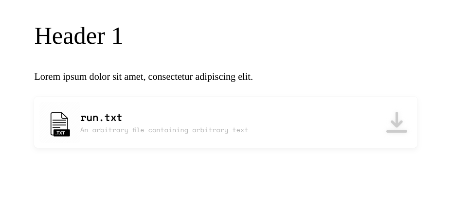
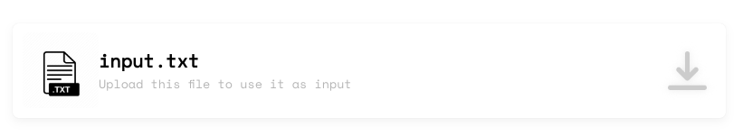

# Harser

###### You're viewing the Kotlin version
###### [Python](https://github.com/ballgoesvroomvroom/harser) version

My own custom text to HTML parser with a terrible name choice.<br>
Used for my own [portfolio page](https://github.com/ballgoesvroomvroom/weter).<br>

With its own semantic layout consisting of `<article>` and `<section>` tags.

Ported the original code written in Python to Kotlin for learning purposes.

## Demo

Plain text input:
```
# Header 1 [article-1]

Lorem ipsum dolor sit amet, consectetur adipiscing elit.
{run.txt}[An arbitrary file containing arbitrary text](../resources/toBeUploaded.txt)
```
Program's output:
```html
<article id="article-1" class="">
	<section id="" class="root-section">
		<h1 id="" class="">
			Header 1
		</h1>
		<p id="" class="">Lorem ipsum dolor sit amet, consectetur adipiscing elit.</p>
		<div class="fileupload" id="">
			
			<div class="fileupload-text" id="">
				<p id="" class="fileupload-header">run.txt</p>
				<p id="" class="fileupload-desc">An arbitrary file containing arbitrary text</p>
			</div>
			<button id="" class=""></button>
		</div>
	</section>
</article>
```

With a little bit of CSS styling,


## Dependancies
Only built-in modules are used, namely `os` (for path handling) and `re` (for regex capturing).<br>
Included a `requirements.txt` just for the sake of it.

## Syntax

Follows the general Markdown syntax.

`# header`: similar to markdown, **H1** headings automatically create a new article, **H2** onwards creates a new section<br>
**H1** headings include an additional `[content]` afterwards followed by a space to denote the **id** for the **article** to enable anchor links

`{#header}`: creates a new header with its level corresponding to the amount of hashes without creating a new section<br>
any amount of spaces between the curly braces and actual content is allowed

`{`: creates a new unstyled **div** element

`{ [l-r]`: creates a directed **div** (div as a flex container); directions can only include "l-r" (left to right) and "r-l" (right to left)

`}`: closes any created **div**s

<code>\`</code>: creates an **inline code** statement

<code>\```</code>: creates a **code** block

`[link_text](link_path)`: similarly to markdown, creates a **hyperlink**

`[caption]`: similarly to markdown, creates an **image** wrapped in `<figure>` with the `<figcaption>` element with its content being the caption proprety

`{filename}[file description](file_path)`: creates a new downloadable file card


## To note
Uses `input.txt` in the parent directory of `/src`, aka root directory of this repository<br>
Doesn't output anything, just prints for now.
